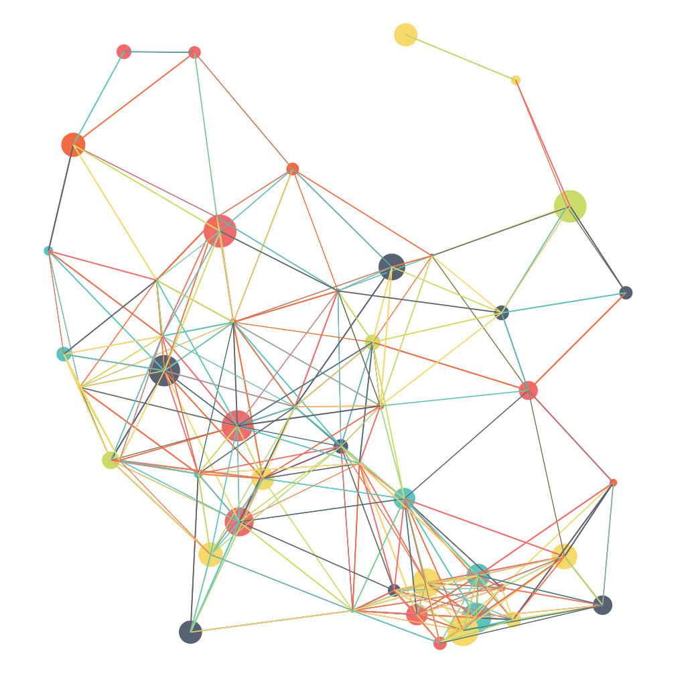
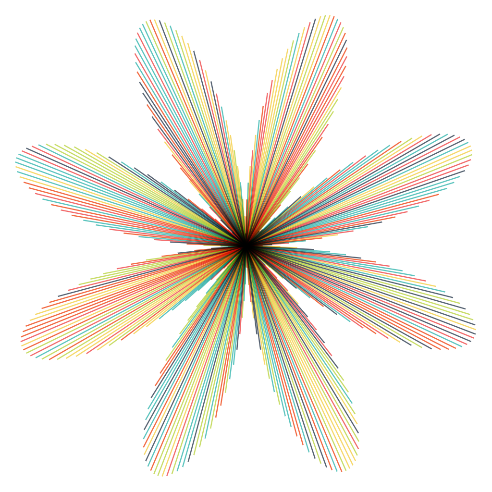
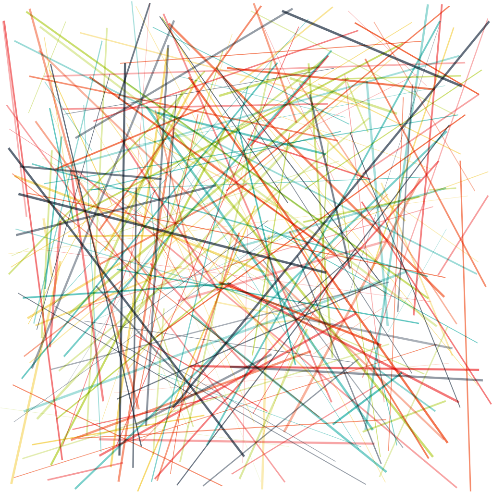
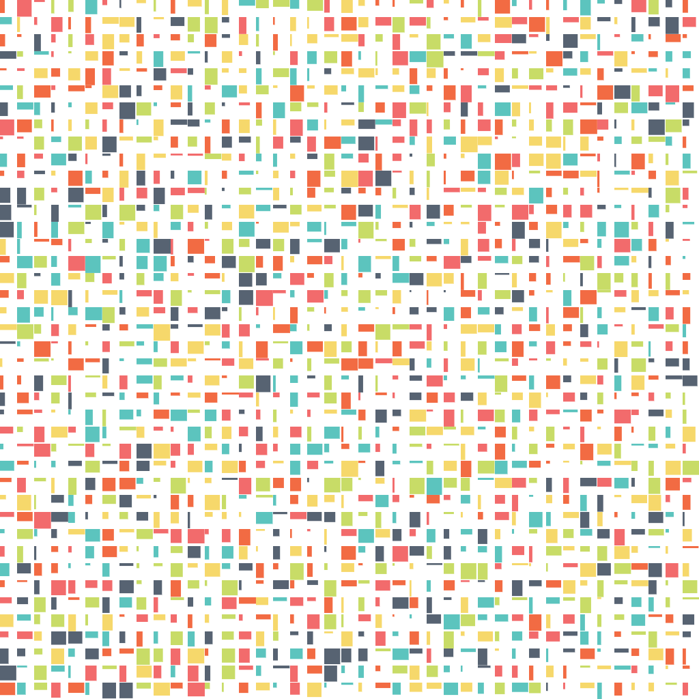
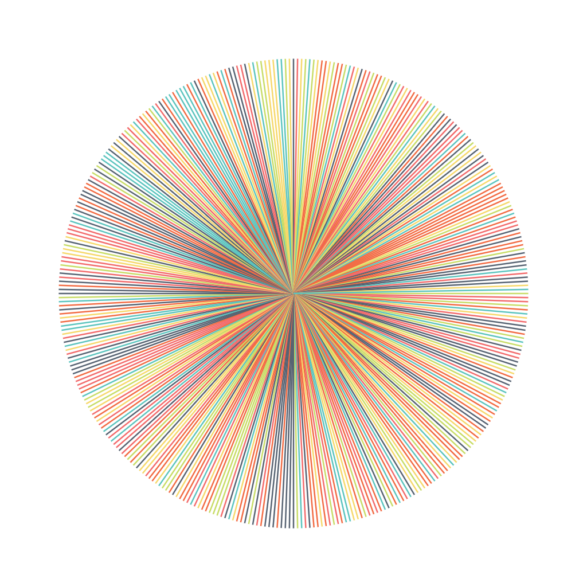
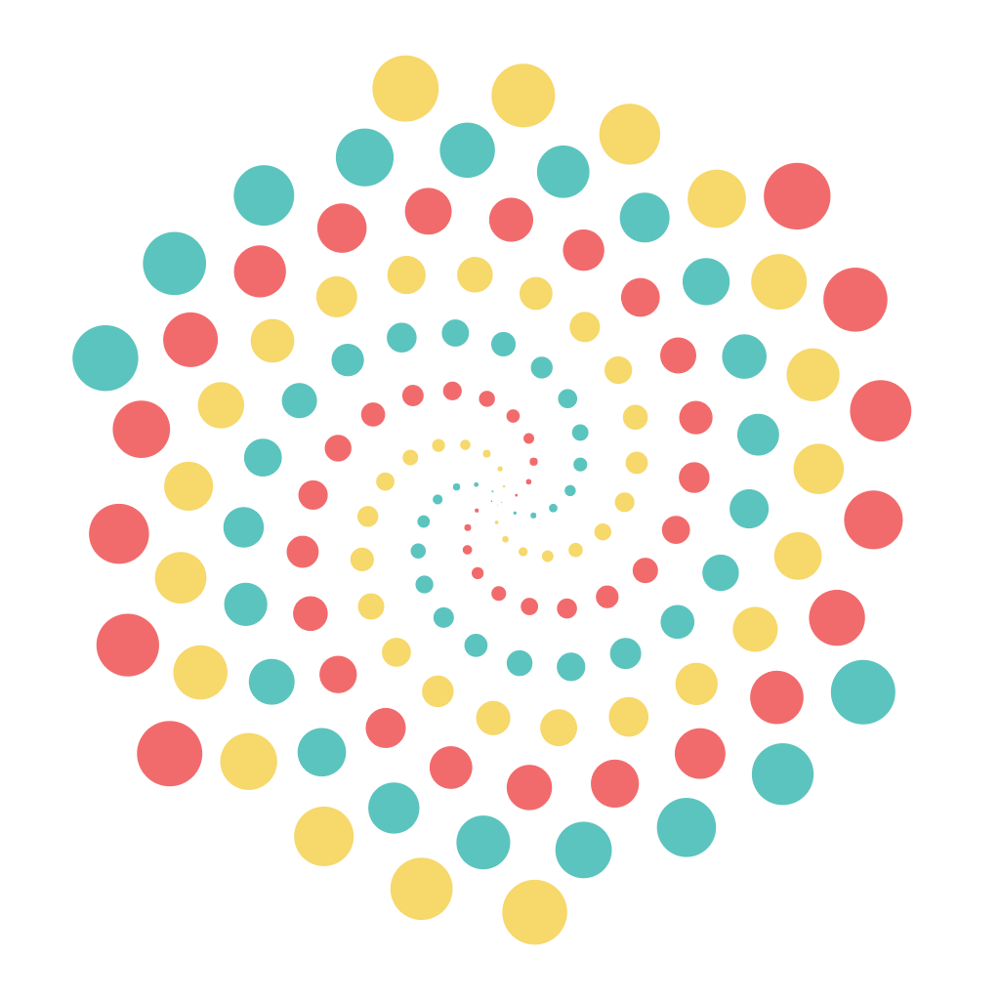

# Teach Kids To Code

**Teach Kids To Code** was a series of posters originally created with [Scriptographer](https://scriptographer.org/) in 2012 by Amelie Maia and Christina Winkless.

These drawings have been updated as interactive NFT's for [hicetnunc](https://www.hicetnunc.xyz/).

The code for these NFT's are completely free to use however you wish!
